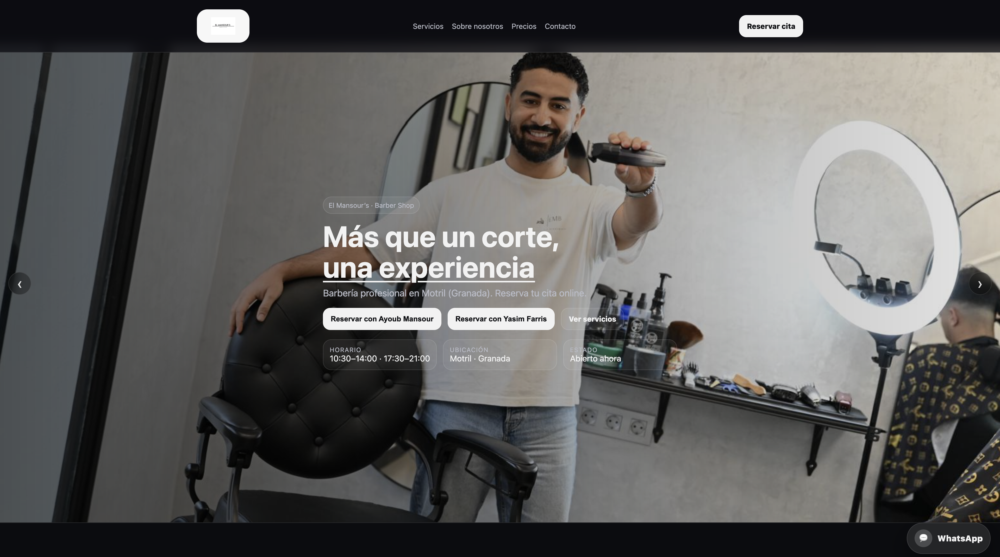

# Peluqueria Web


Proyecto de página web para peluquería desarrollado con React, Vite y CSS.  
Incluye un diseño moderno, responsive y una integración de reservas mediante Calendly.

## Vista previa



## Tecnologías utilizadas

- React
- Vite
- CSS
- Calendly

## Características

- Diseño moderno y responsive
- Sección de presentación de servicios
- Hero con imágenes destacadas
- Integración de reservas online
- Estructura organizada por componentes

## Objetivo del proyecto

Este proyecto forma parte de mi práctica y aprendizaje en desarrollo web, trabajando la maquetación, la estructura de componentes y la mejora de la experiencia visual de una web real.

## Instalación y uso

Clonar el repositorio:

```bash
git clone https://github.com/RaadOtman/peluqueria-web.git
```
